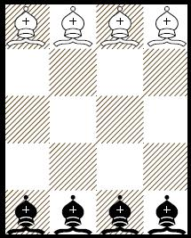

# Futócsere probléma

## Probléma

Adott egy 5×4-es sakktábla, melynek alsó sorában sötét futók, felső sorában világos futók állnak úgy, ahogy
az ábrán látható.

[Szabályos sakklépésekkel](https://en.wikipedia.org/wiki/Bishop_(chess)#Movement) cseréljük fel a világos futókat a sötétekkel.

## Állapottér reprezentáció

Részletesen: [bishop-exchange.pdf](docs/bishop-exchange.pdf)

## Keresők

### Nem módosítható kereső

[brute-force.py](brute-force.py)

Operátor választás módja:

- Billentyűzetről
- Véletlenszerűen
- Hegymászó módszerrel